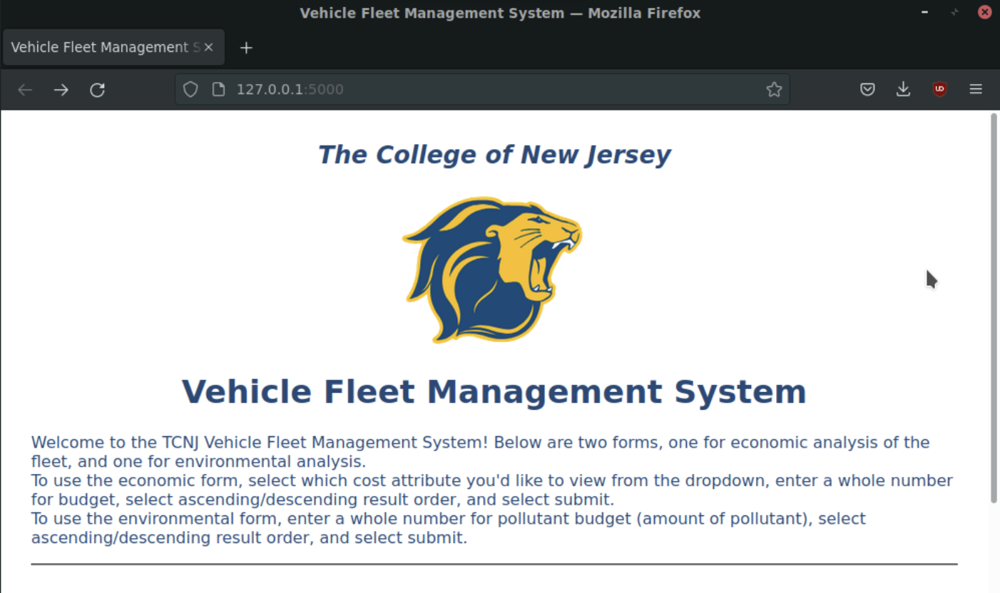
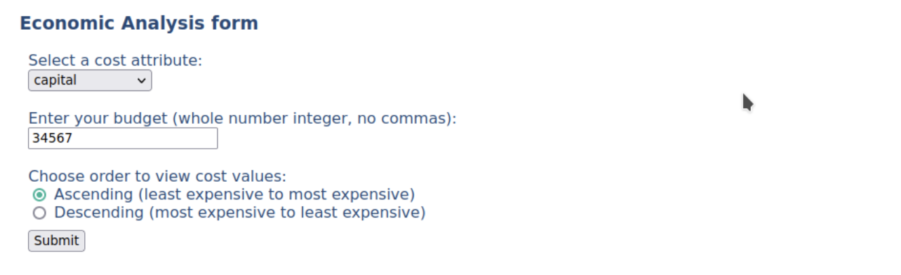
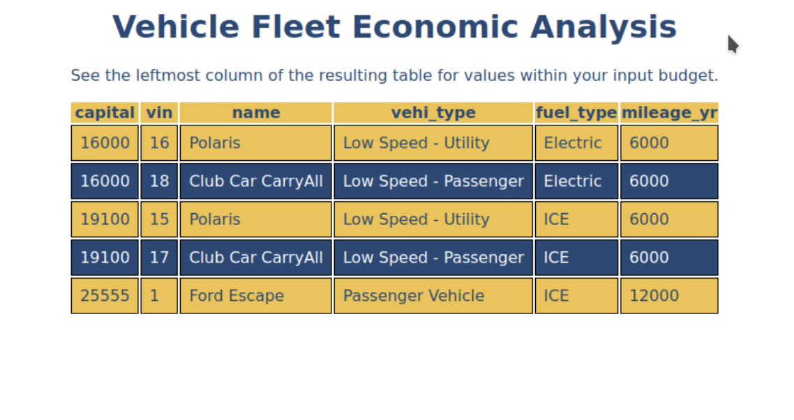
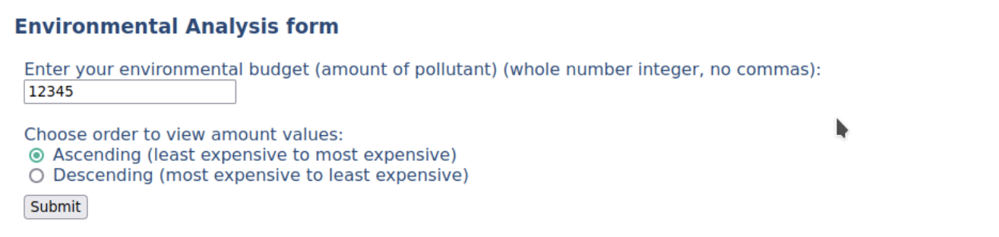
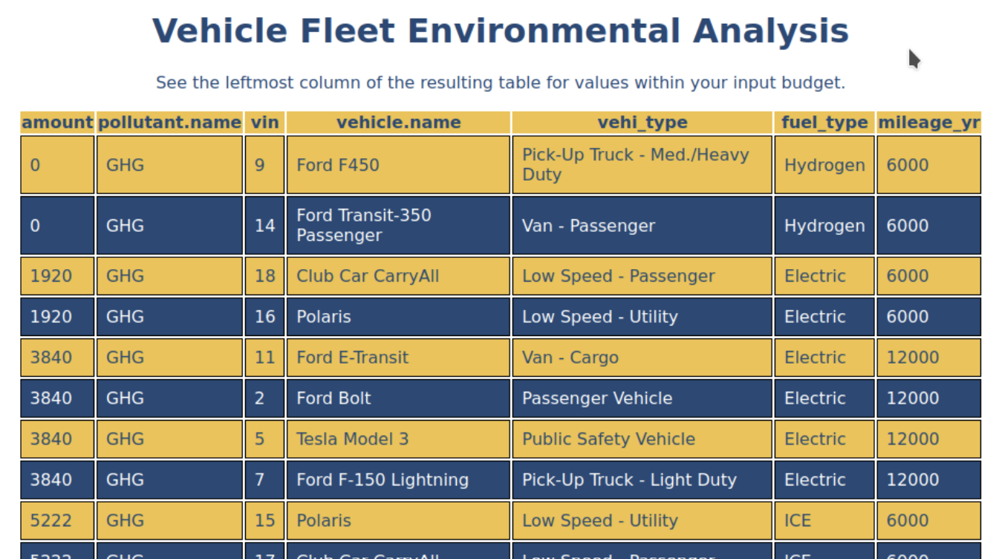

# TCNJ Vehicle Fleet Management System :truck:

## Background
The College of New Jersey manages and operates a fleet of vehicles on its campus. Currently, all of these vehicles operate with internal combustion engines. From an economic and environmental perspective, the fleet is not as efficient and sustainable as it could potentially be with future vehicle upgrades and replacements.

## Objective
This application aims to serve as a tool to aid in decision making regarding future management of the TCNJ vehicle fleet, to allow for decisions to be made that can lead to a more economically and environmentally sustainable vehicle fleet. The system will combine a database and a web-based user interface, which together will allow users to submit forms which retrieve data and provide relevant outputs for the user to use when analyzing management options.

## Installation
This application requires PostgreSQL to be installed on your machine.

Clone this repository into the HOME directory of your machine. After cloning this repository, navigate to the `src/` directory and run the following command to build and populate the project database:
```
sh build_db.sh
```

Next, navigate to the `src/flask/` directory and follow installation instructions explained [here](src/flask/flask7dbs_README.md).

After the project is set up, run `export FLASK_APP=app.py`, and whenever you need to start the app, run `flask run`.

### Things to note:
* If you do not have csv data files, the `sh build_db.sh` command will work (due to empty csv files included in the repo by default), but the database will NOT be populated with any data. See the `src/csv_files/` directory as well as `src/create_tables.sql` to see csv format and data types of attributes.
* To connect the app to the database, you will need to modify the user and password within `src/flask/database.ini` to reflect your own machine.
* To start the app, you must be in the `src/flask/` directory for the `flask run` command to work.

## Application Usage
After setting up and starting the application, navigate to the app URL. You should see the homepage like below:



Scroll down on the home page to view the two forms. First is the economic analysis form, which contains three fields.
1. A dropdown menu that pulls column names from the COST table. Select a cost attribute you are interested in analyzing.
2. A budget field so that you are only shown vehicles that have a cost equal to or less than your budget.
3. An option to view results in ascending or descending cost value order.



Upon submitting this form you are shown a results page like below. A table is displayed, with your cost attribute of interest in the leftmost column. Any vehicles that were outside your budget are not shown.



Back on the home page, scroll further down to view the second form for environmental analysis, which contains two fields.
A budget field so that you are only shown vehicles that have pollutant emission amounts equal to or less than your emissions budget.
An option to view results in ascending or descending emissions amount order.



Upon submitting this form you are shown a results page like below. A table is displayed, with the emissions amount attribute in the leftmost column, as well as a pollutant name column to the right of the amount column. Any vehicles that have emissions greater than your budget are not shown.



## More information
You can visit our wiki pages [here](https://github.com/jstiesi/vfleet/wiki).  
You can view documentation and diagrams for different stages of this project [here](docs/).

## Contributors
Jenna Stiesi, Parvathi Krishnan, Joseph Carmichael, Peter Kobasa, Jessica Giardiello, Sarah Rulkiewicz, Christina Farah

## References
Template code for the web UI was taken from the flask7dbs example application [here](https://github.com/jdegood/flask7dbs).
